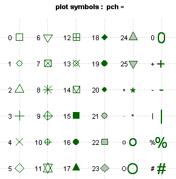
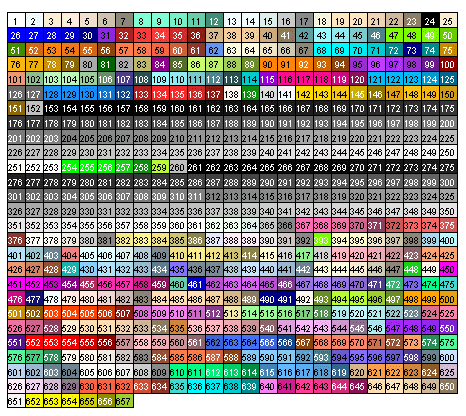
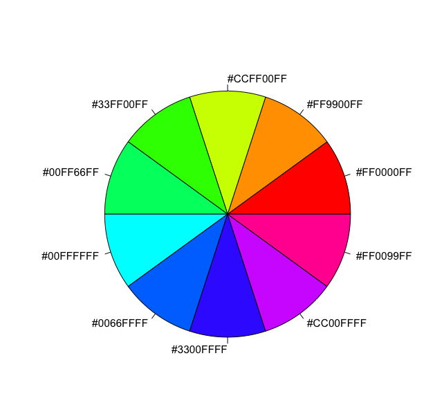
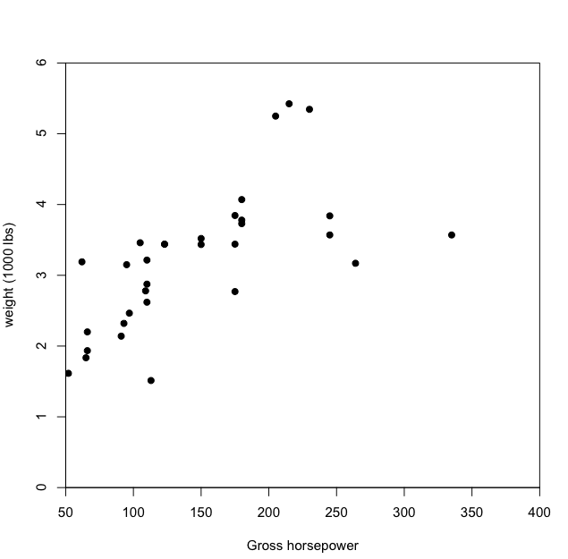

# Graphical Parameters

## Plotting Symbols `pch=`

* values: 1-25
* symbol size: `cex=`
* For symbols 21 through 25, you can also specify the border (col=) and fill (bg=) colors.
	* border color `col=`
	* fill color `bg=`


	a number indicating the amount by which plotting symbols should be scaled relative to the default. 1 = default, 1.5 is 50% larger, 0.5 is 50% smaller, and so forth.



## Lines `lty=` & `lwd=`


option|	description
---|---
lty	|line type. see the chart below.
lwd	|line width relative to the default (default=1). 2 is twice as wide.


## Colors

* value type

	* index: `col=1`
	* name: `col="white"`
	* hexadecimal: `col="#FFFFFF`
	* RGB: `col=rgb(1,1,1)`
	* HSV: `col=hsv(0,0,1)`

* `colors()`: return all available color names

	
* gray: `gray()`

	`gray(0:10/10)` produces 10 gray levels.
	
* functions to create vectors of contiguous colors

	* `rainbow()`

		`rainbow(10)` produces 10 contiguous “rainbow” colors.
	* heat.colors()
	* terrain.colors()
	* topo.colors()
	* cm.colors().

* `RColorBrewer` package

	```r
	
	 library(RColorBrewer)
        n <- 7
        mycolors <- brewer.pal(n, "Set1")
        barplot(rep(1,n), col=mycolors)
	```
	
	```r
	n <- 10
    mycolors <- rainbow(n)
    pie(rep(1, n), labels=mycolors, col=mycolors)
    mygrays <- gray(0:n/n)
    pie(rep(1, n), labels=mygrays, col=mygrays)

	```
	
	
<table>
				<tr>
				<td><strong>option</strong></td>
				<td><strong>description</strong></td>
				</tr>
				<tr>
				  <td><strong>col</strong></td>
				  <td>Default plotting color. Some functions (e.g. lines) accept a vector of values that are recycled. </td>
				  </tr>
				<tr>
				  <td><strong>col.axis</strong></td>
				  <td>color for axis annotation </td>
				  </tr>
				<tr>
				  <td><strong>col.lab</strong></td>
				  <td>color for x and y labels </td>
				  </tr>
				<tr>
				  <td><strong>col.main</strong></td>
				  <td>color for titles </td>
				  </tr>
				<tr>
				  <td><strong>col.sub</strong></td>
				  <td>color for subtitles </td>
				  </tr>
				<tr>
				  <td><strong>fg</strong></td>
				  <td>plot foreground color (axes, boxes - also sets col= to same) </td>
				  </tr>
				<tr>
				  <td><strong>bg</strong></td>
				  <td>plot background color </td>
				  </tr>
				</table>
				
## Text characteristics

### text size

<table>
				<tr>
				<td><strong>option</strong></td>
				<td><strong>description</strong></td>
				</tr>
				<tr>
				  <td><strong>cex</strong></td>
				  <td>number indicating the amount by which plotting text and symbols should be scaled relative to the default. 1=default, 1.5 is 50% larger, 0.5 is 50% smaller, etc. </td>
				  </tr>
				<tr>
				  <td><strong>cex.axis</strong></td>
				  <td>magnification of axis annotation relative to cex </td>
				  </tr>
				<tr>
				  <td><strong>cex.lab</strong></td>
				  <td>magnification of x and y labels relative to cex </td>
				  </tr>
				<tr>
				  <td><strong>cex.main</strong></td>
				  <td>magnification of titles relative to cex </td>
				  </tr>
				<tr>
				  <td><strong>cex.sub</strong></td>
				  <td>magnification of subtitles relative to cex </td>
				  </tr>
				</table>

### text style

<table>
				<tr>
				<td><strong>option</strong></td>
				<td><strong>description</strong></td>
				</tr>
				<tr>
				  <td><strong>font</strong></td>
				  <td>Integer specifying font to use for text. <br />
			      1=plain, 2=bold, 3=italic, 4=bold italic, 5=symbol </td>
				  </tr>
				<tr>
				  <td><strong>font.axis</strong></td>
				  <td>font for axis annotation </td>
				  </tr>
				<tr>
				  <td><strong>font.lab</strong></td>
				  <td>font for x and y labels </td>
				  </tr>
				<tr>
				  <td><strong>font.main</strong></td>
				  <td>font for titles </td>
				  </tr>
				<tr>
				  <td><strong>font.sub</strong></td>
				  <td>font for subtitles </td>
				  </tr>
				<tr>
				  <td><strong>ps</strong></td>
				  <td>font point size (roughly 1/72 inch)<br />
			      text size=ps*cex</td>
				  </tr>
				<tr>
				  <td><strong>family</strong></td>
				  <td>font family for drawing text. Standard values are &quot;serif&quot;, &quot;sans&quot;, &quot;mono&quot;, &quot;symbol&quot;. Mapping is device dependent. </td>
				  </tr>

</table>

## Margins and Graph Size

<table>
				<tr>
				<td><strong>option</strong></td>
				<td><strong>description</strong></td>
				</tr>
				<tr>
				  <td><strong>mar</strong></td>
				  <td>numerical vector indicating margin size c(bottom, left, top, right) in lines.
			      default = c(5, 4, 4, 2) + 0.1 </td>
				  </tr>
				<tr>
				  <td><strong>mai</strong></td>
				  <td>numerical vector indicating margin size c(bottom, left, top, right) in inches </td>
				  </tr>
				<tr>
				  <td><strong>pin</strong></td>
				  <td>plot dimensions (width, height) in inches </td>
				  </tr>
				  
## 3d

### `persp()`

```
with(mtcars, {
  set.seed(1)
  b1 <- seq(-100, 100, length= 100)
  b0 <- seq(-100, 100, length= 100)
  x <- rnorm(100)
  y = rnorm(100)/0.5
  f <- function(x, y) { (y-b1*x-b0)^2 }
  z <- outer(b0, b1, f)
  z[is.na(z)] <- 1
  op <- par(bg = "white")
  # persp(b0, b1, z, theta = 30, phi = 30, expand = 0.5, col = "lightblue")
  persp(b0, b1, z, theta = 30, phi = 30, expand = 0.5, col = "lightblue",
        ltheta = 120, shade = 0.75, ticktype = "detailed",
        xlab = "b0", ylab = "b1", zlab = ""
  ) -> res
})

```

## two axis cross at 0

* `axes = FALSE, xaxs = "i", yaxs = "i"`
* `box()`

```r
with(mtcars, {
	data <- mtcars
	plot(data[, c("hp", "wt")], pch = 19, xlab = "Gross horsepower", ylab = "weight (1000 lbs)",
	axes = FALSE, xlim = c(50, 400), ylim = c(0, 6), xaxs = "i", yaxs = "i")
	axis(1, at = seq(50, 400, 50))
	axis(2, at = 0:6)
	box()
})
```
