股市是个理性的世界

## 预埋单

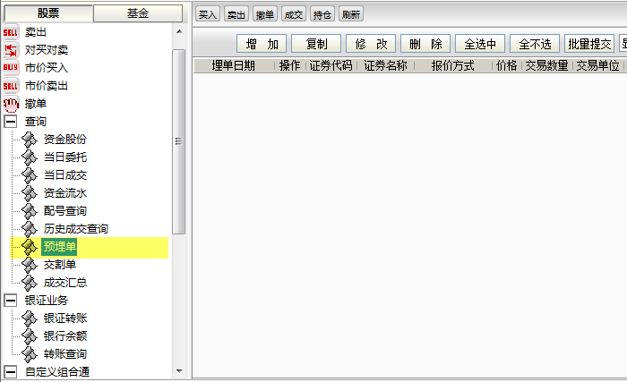

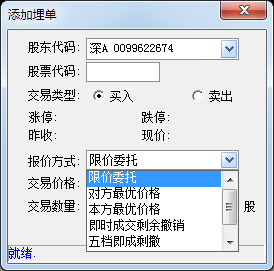

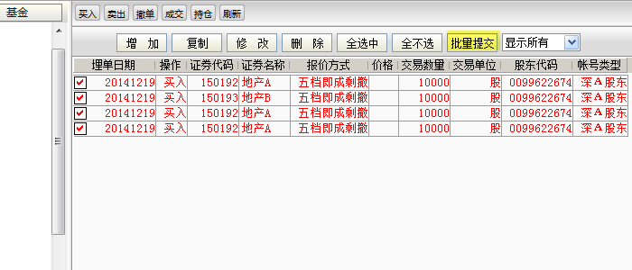

## K线10中典型形态

k线组合能判断股票的优劣

阳线24种形态,阴线24种形态

* 单根k线

	* 阴线实体+上引线: 下压力量
	* 阳线的实体+下引线: 上升力量
	* 阴线实体和上影线较长,说明故事下跌动量比较大
	* 阳线实体+下引线较长,说明股价的扬长动力比较强

* 多空双发的搏斗

	* 收阴
	* 收阳
	* 上影线和下影线的长度比较

	* k线实体一样大小的情况下: 下影线越长, 下档支撑力度越强;上影线越短,上档阻力越小 
	* k线实体一样大小的情况下: 上影线越长, 上档阻力越强;下影线越短,上档支撑越弱

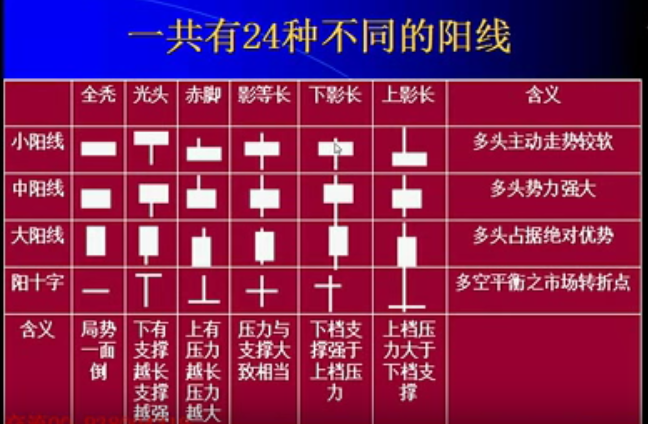

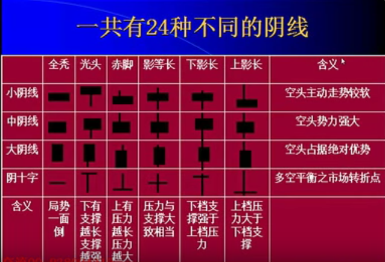

* 阳线: 光头光脚, 没有上下影线
	开盘价=最低价
	收盘价=最高价
	
	常见于牛市
	
	
	
* 阴线: 光头光脚, 没有上下影线
	开盘价=最高价
	收盘价=最低价
	
	常见于跌势中
	
	
* 阳线: 带下影线, 没有上影线
	
	收盘价=最高价
	
	常见于涨势中
	
	可以在低价中买更多
	
	
* 阴线: 带下影线

	开盘价=最高价
	高开低走, 但呈下跌抵抗特征,常见于跌势	

	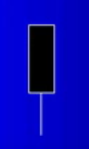
	
* 阳线: 带上影线

	开盘价=最低价
	
	盘中冲高回落, 呈上涨遇阻特征,常见于涨势

	
	
* 阴线: 带上影线, 无下影线

	高开高走, 盘中冲高,但遇阻回落
	
	收盘价=最低价
	
	常见于跌势中
	
	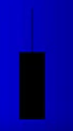
	
* 一字型

	开盘价=最高价=最低价=收盘价
	
	=> 股票成交量勺
	
	常见于一开盘就涨停或跌停的个股
	
	由于极度看涨或极度看空导致单边买盘或者卖盘, 几乎找不到成交对手.常见于有突发消息的个股
	
	
	
* 倒T字型

	开盘价=收盘价
	
	常见于市场的顶部
	
	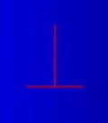
	
* 十字形

	
	
	开盘价=收盘价
	
	盘中价格上下震荡=>市势不明朗
	
	常见于市场顶部或底部
	
	买的和卖的势均力敌
	
	若在底部,则可能会出现反转 i.e.上升
	
* T字形

	开盘价=最高价=收盘价
	盘中价格急剧下探后又被拉起
	
	常见于市场的底部,有看涨意义

	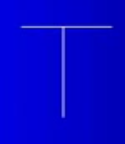
	
	
	
## k线组合

* 红三兵/三连阳: 连续出现三根阳线

	 最常见k线组合
	 
	 出现时: 后势看涨情形居多
	 
	 红三兵 + 成交量变大 => 重点关注
	 
	 * 分批加仓
	 * 若是高位出现,注意风险

	 
	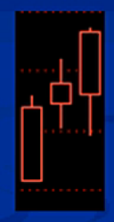
	
	
* 三连阴/三只乌鸦

	不可怕,关键看后续交易日能否修复形态.
	
	在股票价格高出时候,应坚决退出观望
	
	形态修复: 修复到第一根阴线的开盘价 => 股票没问题
	
	
	
* 一阳吞三(两)阴

	典型的反击和攻击组合
	
	表明在调整过程中多方力量突然爆发
	
	短线积极跟进: 短期内会涨的
	
	若玩短线,就去买进.若做长期的,不适合买进. 短线是指2,3天
	
	阴.png)
	
* 两阳夹一阴

	最常见的k线组合,表明短期调整结束
	
	上涨趋势中股价有望新的突破,短线可跟进
	
	向下趋势中应继续观望
	
	
* 断头铡刀: 一个大阴线连续击破几根阳线(均线)

	适合长期投资
	
	该图形是市场陷入恐慌性出逃标志.当有大的利空出现时往往会有这种图形出现
	
	

	
* "早晨之星": 见底信号

	十字形
	
	一般出现在下降趋势的末端, 是见底信号,后市看涨
	
	
	
	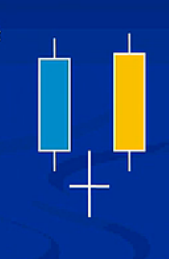
* "黄昏之星": 见顶信号

	若股价出现连续跨苏上涨,并有巨额交易出现时, 星线出现后有长期线=> 见顶信号
	
	减仓退出操作
	
* 多个阳线连续出现

	若果10日均线不被跌破,坚决持有
	
	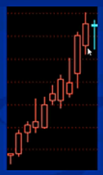
	
* 多个阴线连续出现

	股价出于连续下跌过程
	
	若跌破30日均线或者支撑线应退出操作
	
	出现多个阴线后在30日均线止跌可继续持有观望

	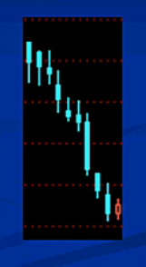
	
	
## 缺口: 非常重要,有主力入场

缺口/跳空: 股价变动中有一段价格没有任何交易,现实在股价K线图上是一个空白区域

k线图中缺口反映出某天股价最高价比后一日最低价还低或者最低价比后一交易日最高价还高 

* 跳空高开: 避免大家都在低价进仓
* 跳空低开
* 股票一开盘就跌停

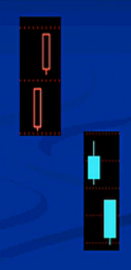

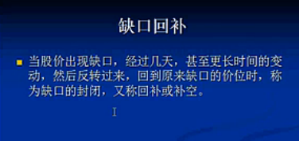

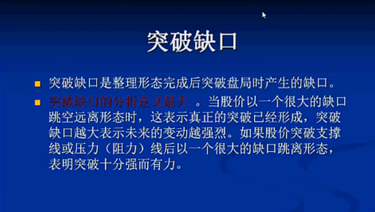
	
* 突破缺口的出现有两种情况

	* 向上的突破缺口: 可积极跟进
	* 向下的突破缺口: 减仓退出

		
## 持续性缺口

在上升或下跌途中出现缺口,多是持续性缺口

持续缺口是股价大幅变动中途产生的,因而不会短时期内封闭

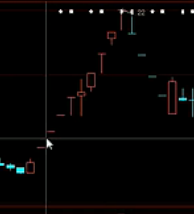

## 消耗性缺口

在大幅度波动过程中(上升或下降)作最后一次跳跃 

* 已经上升, 再跳空上升
* 已经下降, 再跳空下降

通常在恐慌性抛售或在上升的末端出现 => 也叫竭尽缺口

消耗性缺口和普通缺口一样在短时间内会不回

* 上升缺口补下跌
* 下跌缺口补上升

**消耗性缺口在上升的末端多有最大成交出现**
	
## 除权缺口

由于制度因素的原因, 股价在上市公司送配后,股价会出现除权,除息缺口,表现在除权价与股权登记日的收盘价之间的跳空

出圈缺口被回补是填权行情, i.e.,公司会送股给股民来填补
	
	
送股 => 基本面没问题???

若基本面出问题,是主力出逃的时候短线

