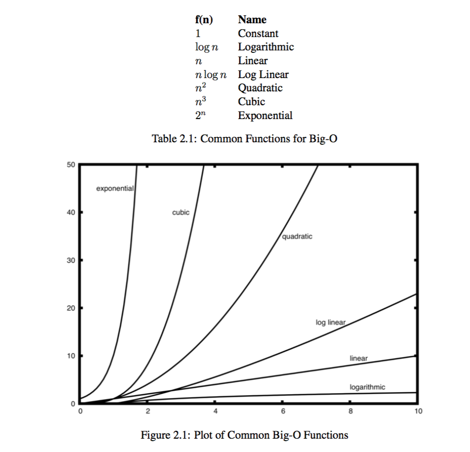

2 criteria to compare algorithms to solve the same problems

* space
* time/execution time/running time

	* benchmark analysis: track the actual time required for the program to compute its result.
		* shortcoming: dependent on 
			* a particular machine
			* rogram
			* time of day
			* compiler
			* programming language
	
	Example:  Python: the starting time and ending time with respect to the system
	
	```python
	import time
	def sum_of_n_2(n):
	  start = time.time()
	  the_sum = 0
  	for i in range(1, n+1):
    	the_sum = the_sum + i
  		end = time.time()
  	return the_sum,end-start
  	
  	for i in range(5):
     	print("Sum is %d required %10.7f seconds" % sum_of_n_2(10000))
	
	```
	
## Big-O Notation

𝑇 (𝑛) is the time it takes to solve a problem of size 𝑛
	
**The order of magnitude function** describes the part of 𝑇 (𝑛) that increases the fastest as the value of 𝑛 increases. **Order of magnitude** is often called **Big-O notation** (for “order”) and written as **𝑂(𝑓(𝑛))**. It provides a useful approximation to the actual number of steps in the computation. The function 𝑓 (𝑛) provides a simple representation of the dominant part of the original 𝑇 (𝑛).
	
Example: the exact number of steps is 𝑇(𝑛) = $5n^2+27n+1005$

the function 𝑇(𝑛) has an order of magnitude 𝑓(𝑛) = $n^2$, or simply that it is 𝑂($n^2$).

* best case performance
* worst case performance
* average case performance

very common order of magnitude functions




Two common operations are indexing and assigning to an index position. Both of these opera- tions take the same amount of time no matter how large the list becomes. When an operation like this is independent of the size of the list they are 𝑂(1).
Another very common programming task is to grow a list. There are two ways to create a longer list. You can use the append method or the concatenation operator. The append method is 𝑂(1). However, the concatenation operator is 𝑂(𝑘) where 𝑘 is the size of the list that is being concatenated. This is important for you to know because it can help you make your own programs more efficient by choosing the right tool for the job.