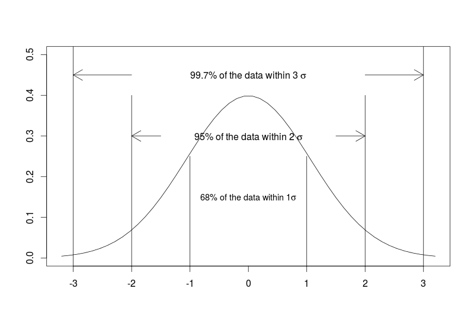

## variance

## standard deviation (of one random variables): 

Standard deviation is a measure of dispersion of the data from the mean.

standard deviation of one random variable $X$ = square error of variance of $X$ = $\sqrt{Var(X)}$ = $sd(X)$

```r
sd <- function (x, na.rm = FALSE) {
	sqrt(var(if (is.vector(x) || is.factor(x)) x else as.double(x), 
    na.rm = na.rm))
}
```

Example: one Normal random variable (mean=0, sd=1)

```r
#generate some random data
set.seed(20151204)
#compute the standard deviation
x<-rnorm(10)
sd(x)
```

```
plot(seq(-3.2,3.2,length=50),dnorm(seq(-3,3,length=50),0,1),type="l",xlab="",ylab="",ylim=c(0,0.5))
segments(x0 = c(-3,3),y0 = c(-1,-1),x1 = c(-3,3),y1=c(1,1))
text(x=0,y=0.45,labels = expression("99.7% of the data within 3" ~ sigma))
arrows(x0=c(-2,2),y0=c(0.45,0.45),x1=c(-3,3),y1=c(0.45,0.45))
segments(x0 = c(-2,2),y0 = c(-1,-1),x1 = c(-2,2),y1=c(0.4,0.4))
text(x=0,y=0.3,labels = expression("95% of the data within 2" ~ sigma))
arrows(x0=c(-1.5,1.5),y0=c(0.3,0.3),x1=c(-2,2),y1=c(0.3,0.3))
segments(x0 = c(-1,1),y0 = c(-1,-1),x1 = c(-1,1),y1=c(0.25,0.25))
text(x=0,y=0.15,labels = expression("68% of the data within 1" * sigma),cex=0.9)
```




## standard error of mean (of multiple equally distributed random variables)

**Difficulty: People do not describe standard error using its full name**: 

`standard error of mean` 

<font color="red">Why standard deviation $\beta$ can be estimated by standard error???</font>

= is often used in `The standard error (SE) of a parameter` in the (generalized) linear regression

= the standard deviation of its sampling distribution <font color="blue">(very vague. Should be `standard deveiation of mean of its sampling distribution` )</font>

= an estimate of the standard deviation of a parameter in the (generalized) linear regression. 


If the parameter or the statistic is the mean, it is called the **standard error of the mean (SEM)**. <font color="red">??????? Other statistic can also has standard error???</font>

### **Definition: standard error of mean (SEM)**

random variables $X_1, X_2, \dots, X_n$

$X$ can be anyone, but just one random variable and has the same distribution.

* standard deviation of $X_i$ = $\sqrt{Var(X_i)}$
* standard deviation of mean of $X_1, X_2, \dots, X_n$ = $\frac{\sqrt{Var(X)}}{n}$ <font color="blue"> = $\frac{sd(X)}{n}$Pay attention to the meaning of $X$ on the right side</font>

$$\sigma_{\bar{x}} = \frac{\sigma}{\sqrt{n}}$$

* $\sigma$: the standard deviation of the population
* $n$: the size (number of observations) of the sample 

	<font color="blue">It should be called "the number of random variables in the sample". One sample data for each random variables. 所谓的一个有n个数构成的sample, 其实应该是有n个变量, 每个变量只有1个sample构成的</font>

### estimate

$$s_{\bar{x}} = \frac{s}{\sqrt{n}}$$


```r
stderr <- function(x) 
	sqrt(var(x,na.rm=TRUE)/length(na.omit(x)))
```


<font color="blue">Note: the standard error of the mean depends on the sample size, the standard error of the mean shrink to 0 as sample size increases to infinity.</font>

Example: 3 normal random variables (mean=0, sd=1)

```r
#generate some random data
set.seed(20151204)
#compute the standard deviation
x<-rnorm(10)
sd(x)
```


```r
#computation of the standard error of the mean
sem<-sd(x)/sqrt(length(x))
#95% confidence intervals of the mean
c(mean(x)-2*sem,mean(x)+2*sem)

```

## standard deviation vs standard error


**if give [0.3, 0.2, 0.5]**

**standardard deviation: [0.3, 0.2, 0.5] is 3 samples from one random variable.**

<b>standard error of mean: 
* there are 3 random variables equally distributed
* [0.3, 0.2, 0.5] is 1 sample from 1 random variable, respectively
</b>

## When to use standard deviation? When to use standard error?

<font color="red">
It depends. If the message you want to carry is about the spread and variability of the data, then standard deviation is the metric to use. If you are interested in the precision of the means or in comparing and testing differences between means then standard error is your metric. Of course deriving confidence intervals around your data (using standard deviation) or the mean (using standard error) requires your data to be normally distributed. Bootstrapping is an option to derive confidence intervals in cases when you are doubting the normality of your data.

In scientific and technical literature, experimental data are often summarized either using the mean and standard deviation of the sample data or the mean with the standard error. This often leads to confusion about their interchangeability. However, the mean and standard deviation are descriptive statistics, whereas the standard error of the mean describes bounds on a random sampling process. The standard deviation of the sample data is a description of the variation in measurements, while the standard error of the mean is a probabilistic statement about how the sample size will provide a better bound on estimates of the population mean, in light of the central limit theorem.[8]

Put simply, the standard error of the sample mean is an estimate of how far the sample mean is likely to be from the population mean, whereas the standard deviation of the sample is the degree to which individuals within the sample differ from the sample mean. If the population standard deviation is finite, the standard error of the mean of the sample will tend to zero with increasing sample size, because the estimate of the population mean will improve, while the standard deviation of the sample will tend to approximate the population standard deviation as the sample size increases.

</font>

## plots

* boxplots by group
* histogram by group
* correlation matrix